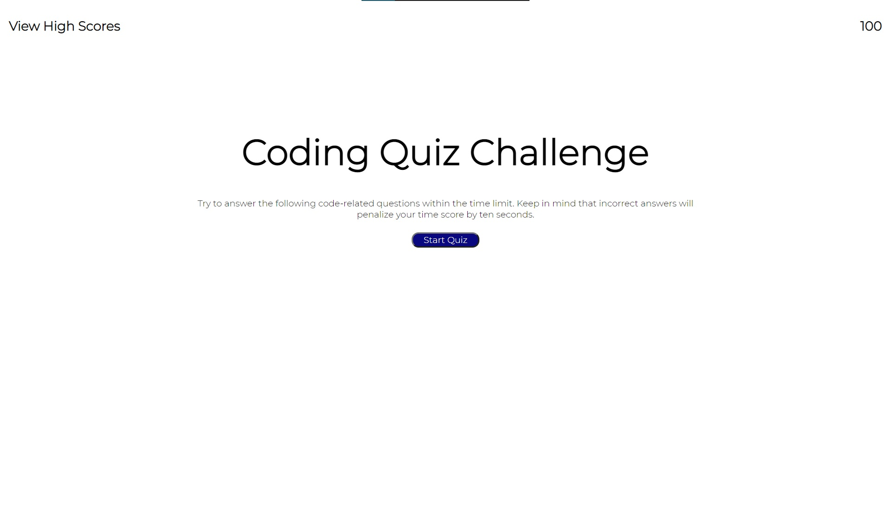
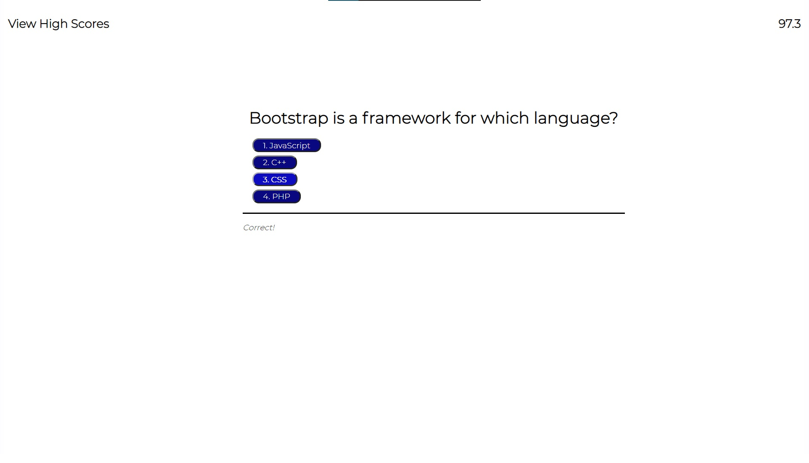
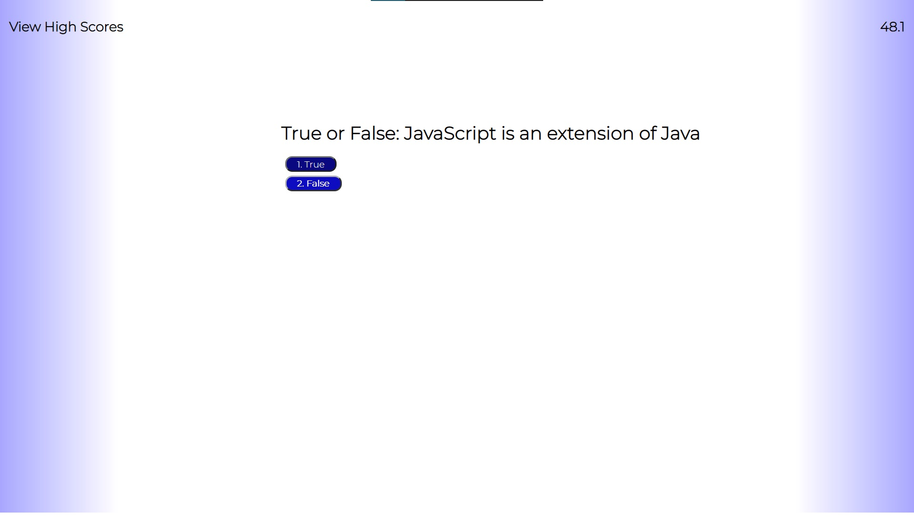
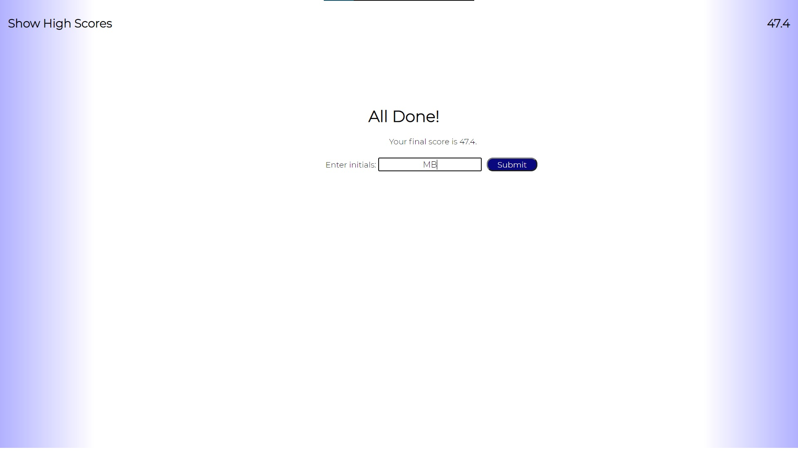
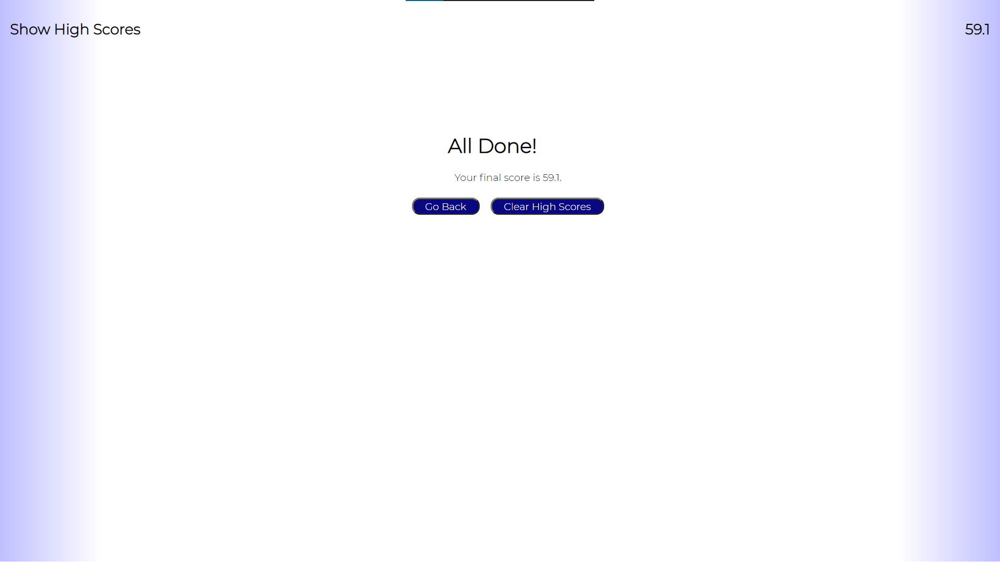
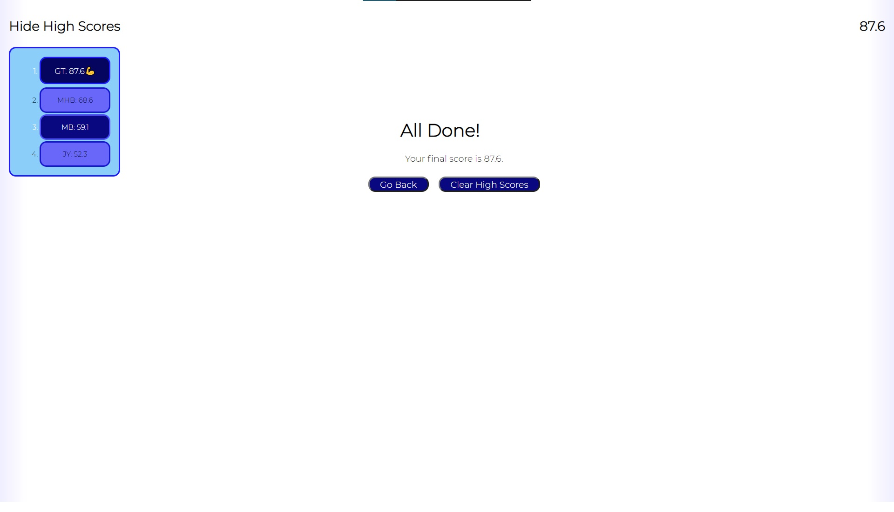

# Homework 4: Code Quiz
#### By Matilda Brantley 

[Live GitHub Page](https://matildabrantley.github.io/homework4-code-quiz/)
## Features
* Class **Question** builds multiple choice question objects with correct answer. 
    * Method displayQuestion changes main-text (h1) to this question text, 
    shows multiple choice buttons and adds event listeners to those buttons.
    * Method answerQuestion is passed to button click events.
* Functions startQuiz and endQuiz handle timer events and setting up or resetting the quiz.
* Functions for handling localStorage and displaying high scores include:
    * submitHighScore - Form submission for name/score
    * addHighScore - sorts and adds to localStorage array of pairs
    * getHighScore - returns localStorage pair array (2D array)
    * updateHighScores - removes and reappends list in order
    * clearHighScores - empties localStorage and removes list items
    * viewHighScores - displays high scores and toggles event listeners and text for view-scores
    * hideHighScores - hides scores, reverts text and event listeners for view-scores
* Function originalStyles targets every element in the DOM tree and sets their styles to null, reverting them to default in css.style. Simplifies resetting quiz and hiding elements (instead of appending/removing). 
* Styling for high score list: alternating colors, best score is larger, hover lights up and enlarges score.
* Ten questions so score only goes down 5 on wrong answers and 0.5 per second.
* Creeping blue radial-gradient to add suspense as score ticks down.

## Screenshots

## User Story

As a coding boot camp student
I want to take a timed quiz on JavaScript fundamentals that stores high scores
So that I can gauge my progress compared to my peers

## Goals of Project

Given I am taking a code quiz

* When I click the start button
    * Then a timer starts and I am presented with a question
* When I answer a question
    * Then I am presented with another question
* When I answer a question incorrectly
    * Then time is subtracted from the clock
* When all questions are answered or the timer reaches 0
    * Then the game is over
* When the game is over
    * Then I can save my initials and my score